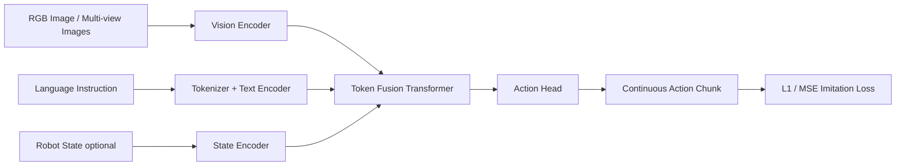

# Mini VLA 架构设计文档

**作者：Manus AI**  
**日期：2026-06-04**  
**目标仓库：God0728/unified**

## 1. 设计目标

本项目的目标不是直接复刻 OpenVLA 或 SmolVLA 的完整规模，而是在现有 `unified` 仓库中新增一个**可读、可改、可训练、可扩展**的 Mini VLA（Vision-Language-Action）框架。它的核心价值在于帮助研究者补齐 VLA 的工程经验：从视觉、语言、状态输入，到跨模态融合，再到连续动作 chunk 输出；从 synthetic 预训练数据跑通，到后续接入 LeRobot、LIBERO 或 Open X-Embodiment 风格数据做 imitation learning 微调。

OpenVLA 证明了在预训练 VLM 上引入机器人动作建模可以得到可迁移的通用机器人策略，并且其公开摘要指出 OpenVLA 由 Llama 2 语言模型、DINOv2 与 SigLIP 视觉特征融合模块组成，并在 970k 真实机器人示范上训练[^1]。Open X-Embodiment 则提供了跨 22 种机器人实体、超过 1M 条真实机器人轨迹的数据基础，并采用常见的 7 维动作表示：`x, y, z, roll, pitch, yaw, gripper`[^2]。这些系统的规模较大，直接复现成本高，因此本项目采用**mini-first** 路线：先搭建完整闭环，再逐步替换更强的 encoder、数据集和分布式训练策略。

> Open X-Embodiment 项目页面对动作空间的描述为：机器人动作是一个 7 维向量，包括 `x, y, z, roll, pitch, yaw, gripper opening`；未使用的维度在训练时置零[^2]。这为 Mini VLA 的默认动作接口提供了一个清晰、通用的起点。

## 2. 总体架构

Mini VLA 的默认输入包括一张或多张 RGB 图像、自然语言任务指令、可选机器人 proprioceptive state，以及可选历史动作或时间步信息。模型输出为一个连续动作 chunk，形状为 `[chunk_size, action_dim]`。默认 `action_dim=7`，默认 `chunk_size=8`，损失函数默认为 L1。这个选择受到 OpenVLA-OFT 的启发：其研究表明，并行解码、action chunking、连续动作表示和 L1 回归目标能够显著提升 VLA 后训练的推理效率和策略表现[^3]。

| 模块 | 默认实现 | 输入 | 输出 | 可替换方向 |
|---|---|---|---|---|
| Vision Encoder | 小型 CNN patch/token encoder | RGB 图像 `[B, C, H, W]` 或多视角 `[B, V, C, H, W]` | 视觉 token `[B, N_img, D]` | ResNet18、DINOv2、SigLIP、CLIP |
| Text Encoder | 简单 tokenizer + Transformer encoder | 指令字符串或 token ids | 文本 token `[B, N_txt, D]` | TinyLlama、Qwen2、T5、BERT |
| State Encoder | MLP | 机器人状态 `[B, state_dim]` | 状态 token `[B, 1, D]` | FiLM、adaptive layer norm、state tokens |
| Fusion Backbone | Transformer encoder | 拼接后的 multimodal tokens | 融合 token `[B, N, D]` | decoder-only LLM、cross-attention、Perceiver |
| Action Head | MLP continuous head | pooled token 或 `[ACT]` token | 动作 `[B, chunk, action_dim]` | mixture density、diffusion head、discrete tokenizer |

在实现上，Mini VLA 不强依赖大型 Hugging Face 模型或特定机器人仿真环境。默认 demo 可以只依赖 PyTorch、torchvision、Pillow、NumPy 与 PyYAML 运行 synthetic 数据训练，从而保证用户在租用 GPU 后可以先验证训练环境，再逐步切换到真实数据。



## 3. 训练阶段划分

Mini VLA 的训练被拆成两个阶段。第一阶段是 **pretrain pipeline**，目标是让模型先掌握视觉、语言和动作输出之间的基本对齐关系，而不是追求真实机器人成功率。第二阶段是 **post-train / fine-tuning pipeline**，目标是接入开源机器人数据集，用离线 imitation learning 训练一个语言条件策略。

| 阶段 | 数据来源 | 训练目标 | 默认脚本 | 产物 |
|---|---|---|---|---|
| Pretrain | synthetic VLA 数据、可选 LeRobot 数据 | 从图像、指令和状态预测 action chunk | `scripts/pretrain_mini_vla.py` | `checkpoint_step_*.pt`、`config_resolved.yaml` |
| Post-train | LIBERO demonstrations、LeRobot datasets、Open X-Embodiment 子集 | 适配具体任务/机器人动作分布 | `scripts/finetune_mini_vla.py` | fine-tuned checkpoint |
| Inference | 单条观测或离线 batch | 输出连续 action chunk | `scripts/infer_mini_vla.py` | JSON/NPY 动作预测 |

第一阶段默认使用 synthetic 数据，是因为当前任务强调**完成完整架构与 pretrain pipeline**。Synthetic 数据集会构造简单几何图像、任务文本和目标动作之间的可学习映射。虽然它不等价于真实机器人数据，但能有效验证：数据读取、tokenization、forward、loss、反向传播、checkpoint、resume、日志与配置系统是否完整。完成该闭环后，真实数据只需要实现相同 batch schema 即可复用训练器。

第二阶段推荐优先接入 LIBERO 与 LeRobot。LIBERO 提供语言条件的仿真操作任务与高质量演示，并包含 Spatial、Object、Goal、LIBERO-100 等任务套件[^4]。LeRobot 则提供了社区友好的机器人数据格式，典型字段包括 `observation.images.*`、`observation.state`、`action`、`episode_index`、`frame_index` 和任务文本，并支持从 Hugging Face Hub 下载和索引数据[^5]。SmolVLA 文档也强调，轻量 VLA 更适合在 LeRobot 数据集上微调，并通常以多视角图像、当前传感器状态与自然语言指令作为输入，输出 action chunk[^6]。

## 4. 数据接口约定

为了让 synthetic、LeRobot、LIBERO 和未来自定义数据都能复用同一训练器，本项目定义统一 batch schema。所有 dataset adapter 最终都应返回以下字段。

| 字段 | 类型 | 形状 | 说明 |
|---|---|---|---|
| `images` | `torch.float32` | `[B, C, H, W]` 或 `[B, V, C, H, W]` | 已归一化到 `[0, 1]` 的 RGB 图像 |
| `input_ids` | `torch.long` | `[B, T]` | 指令 token ids |
| `attention_mask` | `torch.bool` | `[B, T]` | 文本有效 token mask |
| `state` | `torch.float32` | `[B, state_dim]` | 可选机器人状态；无状态时置零 |
| `actions` | `torch.float32` | `[B, chunk_size, action_dim]` | 目标动作 chunk |
| `metadata` | `dict` | 无固定形状 | 数据源、任务名、episode/frame 等信息 |

动作归一化是 VLA 后训练中非常容易被忽视但影响巨大的细节。默认实现提供 `ActionNormalizer`，支持从训练集估计 `mean/std` 或 `min/max`，并在 checkpoint 中保存统计量。对于跨数据集训练，推荐先按数据源统计动作分布，再决定是否使用共享 normalization 或 per-dataset normalization。

## 5. 模型细节

Mini VLA 采用 encoder-only 融合路线，避免一开始就引入大语言模型训练的复杂性。每个样本会构造一个 token 序列：`[CLS] + text tokens + image tokens + optional state token`。Fusion Transformer 对该序列做多层自注意力，最后读取 `[CLS]` 或专用 `[ACT]` token 的 hidden state，经 MLP 输出动作 chunk。

该设计保留了向 OpenVLA 风格 decoder-only VLA 扩展的空间。后续如果要接入 TinyLlama/Qwen2，可以将 text encoder 与 fusion backbone 替换为 causal LM，并把视觉 token 作为 prefix。若希望接入 OpenVLA-OFT 风格后训练，可以保留连续 action head，并将 action chunk 作为并行输出，而不是把每一维动作离散化为文本 token。

| 设计点 | 默认选择 | 原因 |
|---|---|---|
| 动作表示 | 连续动作 chunk | 与机器人控制更直接，训练简单，受 OFT 经验支持[^3] |
| 损失函数 | L1 loss | 对演示噪声相对稳健，OpenVLA-OFT 报告了 L1 recipe 的实用性[^3] |
| 视觉分辨率 | `128 x 128` | 降低预训练调试成本，可后续升到 `224 x 224` |
| 文本 tokenizer | 项目内 simple tokenizer | 避免因外部 tokenizer 下载阻塞 pipeline |
| 默认数据 | synthetic | 保证无硬件、无外部数据时也能跑通完整闭环 |
| 后训练数据 | LIBERO / LeRobot | 都有开源生态，适合无真实硬件训练与评估[^4] [^5] |

## 6. 代码结构

新增代码采用独立包 `mini_vla`，避免破坏仓库中已有的 Unified Transition Diffusion Model 代码。预期目录如下。

```text
unified/
├── mini_vla/
│   ├── models/
│   │   ├── vision.py
│   │   ├── text.py
│   │   ├── fusion.py
│   │   ├── action_head.py
│   │   └── mini_vla.py
│   ├── data/
│   │   ├── tokenizer.py
│   │   ├── synthetic.py
│   │   ├── lerobot_dataset.py
│   │   ├── libero_dataset.py
│   │   └── collate.py
│   ├── training/
│   │   ├── config.py
│   │   ├── trainer.py
│   │   └── checkpointing.py
│   └── utils/
│       ├── seed.py
│       └── logging.py
├── configs/
│   ├── mini_vla_pretrain.yaml
│   └── mini_vla_finetune.yaml
├── scripts/
│   ├── pretrain_mini_vla.py
│   ├── finetune_mini_vla.py
│   └── infer_mini_vla.py
└── docs/
    └── mini_vla_design.md
```

## 7. GPU 训练建议

为了让用户能够在租用 GPU 后快速验证，默认配置会提供三个档位。`debug` 档位可以在 CPU 或小显存 GPU 上跑通；`single_gpu` 档位面向 24GB 到 48GB 显存；`larger_pretrain` 档位用于多卡或更长训练。OpenVLA-OFT 页面报告其 7B 级后训练在 LIBERO 场景下最低显存大约需要 25GB 以上，而推荐配置可达 44GB 以上[^7]。Mini VLA 的规模远小于 7B，因此默认配置会把 batch size、hidden dim 和图像分辨率控制在单卡可调试范围内。

| 档位 | 建议硬件 | hidden dim | layers | batch size | image size | 用途 |
|---|---:|---:|---:|---:|---:|---|
| `debug` | CPU / 任意 GPU | 128 | 2 | 4 | 64 | 单元测试与 smoke test |
| `single_gpu` | 12GB-24GB GPU | 256 | 4 | 32 | 128 | synthetic pretrain 与小数据微调 |
| `larger_pretrain` | 48GB+ GPU 或多卡 | 512 | 6-8 | 64+ | 224 | 更真实的数据预训练 |

## 8. 后续扩展路线

第一版交付完成后，最自然的扩展路线是三步。首先，用 LeRobot 的公开数据集替换 synthetic 数据，并确保数据 adapter 能正确抽取图像、语言、状态与动作。其次，接入 LIBERO 进行离线 imitation learning，并增加 rollout evaluation 脚本。最后，用更强的视觉与语言 backbone 替换 mini encoder，例如 DINOv2/SigLIP 与 TinyLlama/Qwen2，并引入 LoRA 或冻结大部分 backbone 参数以降低显存开销。

| 里程碑 | 目标 | 风险 | 缓解策略 |
|---|---|---|---|
| M1 | Synthetic pretrain 完整跑通 | 数据过于玩具化 | 明确其定位为 pipeline validation |
| M2 | LeRobot dataset adapter 可用 | 字段命名随数据集变化 | 提供 field mapping 配置 |
| M3 | LIBERO fine-tune 可用 | 环境依赖较重 | 先支持离线 HDF5/NPY demonstration，再做 rollout |
| M4 | 强 backbone 替换 | 显存和下载依赖增加 | 支持冻结、LoRA 和 gradient checkpointing |
| M5 | 分布式训练 | 配置复杂 | 用 `torchrun` 与 DDP 做最小实现 |

## References

[^1]: [OpenVLA: An Open-Source Vision-Language-Action Model](https://arxiv.org/abs/2406.09246)。
[^2]: [Open X-Embodiment: Robotic Learning Datasets and RT-X Models](https://robotics-transformer-x.github.io/)。
[^3]: [Fine-Tuning Vision-Language-Action Models: Optimizing Speed and Success](https://arxiv.org/abs/2502.19645)。
[^4]: [LIBERO: Benchmarking Knowledge Transfer for Lifelong Robot Learning](https://github.com/Lifelong-Robot-Learning/LIBERO)。
[^5]: [LeRobot: Making AI for Robotics more accessible with end-to-end learning](https://github.com/huggingface/lerobot)。
[^6]: [SmolVLA Documentation](https://huggingface.co/docs/lerobot/en/smolvla)。
[^7]: [OpenVLA-OFT Project Page](https://openvla-oft.github.io/)。
